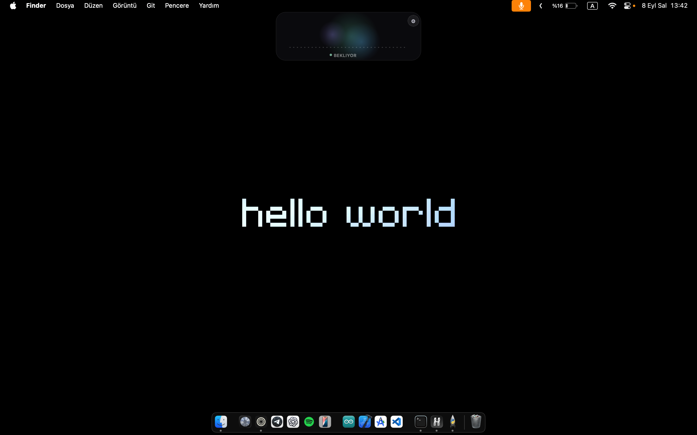
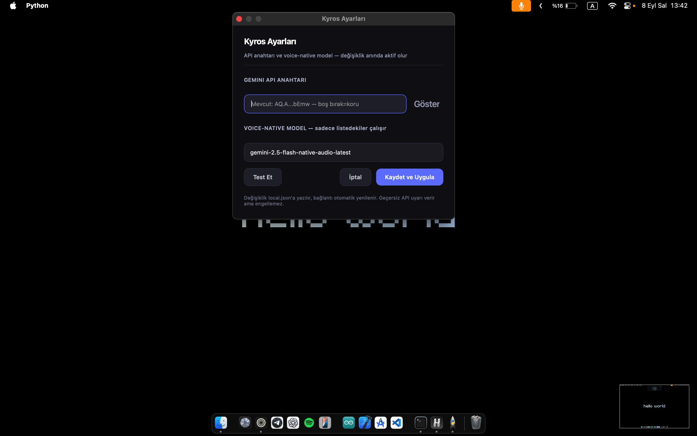
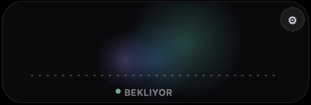

<div align="center">

# KYROS

### ИИ-ассистент для рабочего стола macOS

*Говорите естественно. Kyros слушает, понимает и действует.*

[](https://www.apple.com/macos/)
[](https://www.python.org/)
[](https://ai.google.dev/)
[](LICENSE)
[](https://github.com/rhymezip/kyros-onlin-desktop-assistant/pulls)
[](https://github.com/rhymezip/kyros-onlin-desktop-assistant/issues)
[](https://github.com/rhymezip/kyros-onlin-desktop-assistant/stargazers)
[](https://github.com/rhymezip/kyros-onlin-desktop-assistant/network/members)

<br>

**Kyros** — это голосовой ассистент реального времени, работающий на вашем Mac и подключающийся к API Google Gemini Live.
Обеспечен аудиодвижком полного дуплекса на Swift, плавающей панелью в стиле Dynamic Island и мощной системой инструментов для управления всем Mac голосом.

Нет зашитых команд. Нет отдельного конвейера STT/TTS. Нет регулярных выражений.
**Одна модель. Один аудиопуть. Чистый диалог.**

<br>



</div>

---

## Содержание

- [Возможности](#-возможности)
- [Демо](#демо)
- [Архитектура](#архитектура)
- [Быстрый старт](#быстрый-старт)
- [Требования](#требования)
- [Установка](#установка)
- [Использование](#использование)
- [Голосовые команды](#голосовые-команды)
- [Состояния сессии](#состояния-сессии)
- [Панель и настройки](#панель-и-настройки)
- [Инструменты и возможности](#инструменты-и-возможности)
- [Аудиодвижок](#аудиодвижок)
- [Конфигурация](#конфигурация)
- [Тестирование](#тестирование)
- [Устранение неполадок](#устранение-неполадок)
- [Безопасность и конфиденциальность](#безопасность-и-конфиденциальность)
- [Структура проекта](#структура-проекта)
- [Часто задаваемые вопросы](#часто-задаваемые-вопросы)
- [Участие в проекте](#участие-в-проекте)
- [Лицензия](#лицензия)
- [English](README.md)
- [Türkçe](README.tr.md)

---

## Возможности

<table>
<tr>
<td width="50%">

**🎤 Живой звук**
Полный дуплекс с подавлением эха. Микрофон 16 кГц, TTS 24 кГц, чанки 20 мс, VAD 350 мс.

**🧠 Gemini Native Audio**
`gemini-2.5-flash-native-audio` — одна модель нативно обрабатывает диалог, вызов инструментов и синтез речи.

**🖥️ Полное управление Mac**
Shell-команды, AppleScript/JXA, Accessibility API (клики, перетаскивание, прокрутка, ввод текста, скриншоты), автоматизация приложений.

**🔍 Google Поиск**
Встроенный инструмент веб-поиска, напрямую привязанный к сессии Live — браузер не нужен.

</td>
<td width="50%">

**🎙️ Умное управление сессиями**
*Hey Kyros* для пробуждения, *you can wait* для ожидания, *stop* для остановки. Решает модель.

**🛡️ Устойчивое соединение**
Восстановление сессий, восстановление буферов, автоматическое переподключение. Переживает сетевые сбои.

**🌊 Dynamic Island UI**
Плавающая панель 300×100 с транскриптом, уровнем микрофона, настройками и контекстным меню.

**🔐 Безопасность по дизайну**
API-ключи хранятся с правами `0600`, никогда не логируются. Привилегированные команды используют нативные диалоги аутентификации macOS.

</td>
</tr>
</table>

> **Принцип проектирования:** Kyros использует универсальные инструменты, composing at runtime. Примеры команд вроде *«открой Заметки»* или *«поищи Fenerbahçe»* не имеют зашитых ветвлений — модель управляет всем.

---

## Демо

<p align="center">
  
</p>
<p align="center">
  
</p>

---

## Архитектура

```
                    ┌─────────────────────────────────────────────┐
                    │              Gemini Live (WSS)               │
                    │     gemini-2.5-flash-native-audio            │
                    └──────────┬──────────────────┬───────────────┘
                               │  PCM 24k (TTS)   │  Вызовы инструментов
                               ▼                  ▼
┌──────────────────────────────────────────────────────────────────┐
│                      Рабочий стол macOS                           │
│                                                                  │
│  ┌──────────────┐    ┌──────────────┐    ┌───────────────────┐  │
│  │  AVAudioEngine│    │  PyQt6 Panel │    │  Tool Executor    │  │
│  │  (Swift)      │    │  (Dynamic    │    │  ┌─────────────┐ │  │
│  │  • Микрофон   │    │   Island)    │    │  │ run_shell    │ │  │
│  │  • Динамик    │    │  • Транскрипт│    │  │ run_apple-   │ │  │
│  │  • Подавл.эха │    │  • Ур.микр.  │    │  │   script     │ │  │
│  │  • VAD        │    │  • Настройки │    │  │ computer     │ │  │
│  └──────┬───────┘    │  • Управл.   │    │  │  (AX/API/    │ │  │
│         │ PCM 16k     └──────────────┘    │  │  скриншот)   │ │  │
│         └────────────────────────────────▶│  │ read_web     │ │  │
│                                           │  │ google_search│ │  │
│                                           │  └─────────────┘ │  │
│                                           └───────────────────┘  │
└──────────────────────────────────────────────────────────────────┘
```

**Ключевые решения по архитектуре:**
- **Одномодельная архитектура** — Нет отдельного STT/TTS. Gemini обрабатывает голос нативно.
- **Полный дуплекс** — Микрофон и динамик используют один `AVAudioEngine` с обработкой голоса Apple.
- **Отменяемые инструменты** — Каждый инструмент — задача `asyncio`. Прерывание мгновенно очищает очередь.
- **Композитные инструменты** — Нет сопоставления намерений или regex. Модель решает, какие инструменты вызвать.

---

## Быстрый старт

```bash
# 1. Клонировать
git clone https://github.com/rhymezip/kyros-onlin-desktop-assistant.git
cd kyros-onlin-desktop-assistant

# 2. Установить (создаёт venv, ставит зависимости, собирает аудиодвижок)
bash install.sh

# 3. Запустить
venv/bin/python main.py
```

Всё. Откроется панель, вставьте API-ключ Gemini в Настройках — и вы в деле.

---

## Требования

| Компонент | Версия | Примечания |
|-----------|--------|------------|
| **macOS** | 13+ | Рекомендуется: 15.x (Sequoia) |
| **Python** | 3.10 – 3.14 | Рекомендуется: **3.12** |
| **Apple CLI Tools** | Последние | `xcode-select --install` |
| **API-ключ Gemini** | — | Получить на [aistudio.google.com](https://aistudio.google.com) |

> Python-код кросс-платформенный; Swift-аудиодвижок и API Live требуют macOS.

---

## Установка

### Вариант А: Автоматическая (рекомендуется)

```bash
git clone https://github.com/rhymezip/kyros-onlin-desktop-assistant.git
cd kyros-onlin-desktop-assistant
bash install.sh
```

**Что делает `install.sh`:**
1. Находит совместимый Python (3.10–3.14), создаёт `venv/`
2. Устанавливает все зависимости из `requirements.txt`
3. Запрашивает API-ключ Gemini (если не задан) → записывает `config/local.json` с правами `0600`
4. Собирает Swift-аудиодвижок (`native/kyros-audio`)
5. Автоматически запускает тесты

### Вариант Б: Ручная

```bash
python3 -m venv venv
source venv/bin/activate
pip install -r requirements.txt
bash build_audio.sh
```

Затем задайте API-ключ:

```bash
export GEMINI_API_KEY="ваш-ключ-здесь"
```

Или скопируйте шаблон:

```bash
cp config/local.json.example config/local.json
# Отредактируйте config/local.json и добавьте ключ
```

### Первый запуск без API-ключа

При первом запуске без API-ключа Kyros автоматически открывает панель **Настроек** через 900мс. Вставьте ключ, нажмите **Test**, затем **Save and Apply** — соединение стартует через ~0.6с.

---

## Использование

### Команды запуска

```bash
venv/bin/python main.py                  # Панель + Live (рекомендуется)
venv/bin/python main.py --text           # Текстовый режим, без микрофона
venv/bin/python main.py --no-panel       # Без GUI, headless
venv/bin/python main.py --audio-check    # Только проверка аудиодвижка
venv/bin/python main.py --doctor         # Диагностические проверки
venv/bin/python main.py --debug          # Подробное логирование
```

### Голосовые команды

Говорите естественно. Kyros понимает контекст и собирает инструменты на лету:

```text
Hey Kyros, открой Заметки и создай новую заметку «Заметки встречи»

Hey Kyros, поищи последние новости Fenerbahçe и сделай краткую сводку

Hey Kyros, найди Али в Telegram и отправь «Увидимся завтра»

Hey Kyros, посмотри на мой рабочий стол и организуй файлы по типу

Hey Kyros, какая сейчас погода в Стамбуле?
```

### Управление сессией

| Скажите | Что происходит |
|---------|---------------|
| **Hey Kyros** | Пробуждается из ожидания, начинает слушать |
| **you can wait** | Переходит в ожидание, ждёт следующего пробуждения |
| **stop / cancel** | Отменяет текущие задачи, остаётся активным |
| **Microphone off** | Отключает микрофон через контекстное меню |

> **Примечание:** Только *«Hey Kyros»* пробуждает — произнесение *«Kyros»* в режиме ожидания ничего не делает. Модель принимает решения о пробуждении/ожидании/остановке через `session_control`.

---

## Состояния сессии

| Состояние панели | Значение |
|-----------------|----------|
| `WAITING` | Ожидание — микрофон активен, но инструменты/TTS отключены. Ждёт *Hey Kyros*. |
| `LISTENING` | Активна — микрофон открыт, VAD слушает, готов к командам. |
| `SPEAKING` | Воспроизведение TTS — прерывается командами *stop/silence/one minute*. |
| `APPLYING · LISTENING` | Инструмент выполняется, но микрофон и соединение активны. |
| `AUDIO DEVICE CHANGING` | Изменилось устройство ввода/вывода, автоматическое переподключение. |

---

## Панель и настройки

### Панель

- **Левый клик** — Открывает вид диалога (транскрипт, ссылки на источники, ввод текста, управление)
- **Правый клик** — Контекстное меню (Пробуждение / Стоп / Ожидание / Микрофон / Настройки / Выход)
- **Настройки (⚙)** — API-ключ, выбор голосовой модели, тест соединения

### Панель настроек

| Настройка | Описание |
|-----------|----------|
| **API Key** | Ваш ключ Gemini (`AIza...` или `AQ...`). Переключатель показать/скрыть. |
| **Voice Model** | Выпадающий список доступных моделей native audio (загружается из API). |
| **Test** | Проверяет ключ и доступность модели. Зелёный = готово. |
| **Save & Apply** | Сохраняет в `config/local.json`, перезапускает соединение за ~0.6с. |

> **Важно:** Kyros работает только с прямыми ключами Google Gemini API. Прокси, совместимые с OpenAI (`sk-...`), не поддерживают протокол Live.

---

## Инструменты и возможности

Kyros предоставляет универсальные инструменты, которые модель компонует во время выполнения:

| Инструмент | Описание |
|------------|----------|
| `run_shell` | Выполняет любую команду `zsh`. Поддержка `elevated=true` для админа (диалог пароля macOS). |
| `run_applescript` | Запускает AppleScript или JXA для автоматизации приложений. |
| `computer` | Полное взаимодействие с GUI: `inspect` (дерево AX), `screenshot`, `click`, `drag`, `scroll`, `key`, `type_text`. |
| `read_web` | Получает и читает содержимое веб-страницы. |
| `google_search` | Поиск в интернете напрямую из сессии Live. |
| `session_control` | Действия пробуждения, ожидания и остановки. |

### Что вы можете делать

- **Управление приложениями:** Откройте любое приложение, навигация по меню, заполнение форм
- **Управление файлами:** Создание, редактирование, организация файлов и папок
- **Веб-исследование:** Поиск, чтение статей, резюмирование контента
- **Обмен сообщениями:** Отправка через Telegram, Notes или любое автоматизируемое приложение
- **Системное администрирование:** Выполнение shell-команд с привилегиями
- **Ориентация на экране:** Скриншоты, чтение UI-элементов, взаимодействие с любым видимым контентом

---

## Аудиодвижок

Kyros поставляется с кастомным Swift-аудиодвижком (`native/AudioBridge.swift`) на базе `AVAudioEngine`:

| Функция | Детали |
|---------|--------|
| **Ввод микрофона** | 16 кГц PCM, чанки 20 мс |
| **Вывод TTS** | 24 кГц PCM через `AVAudioSourceNode` |
| **Подавление эха** | Apple Voice Processing (`setVoiceProcessingEnabled`) |
| **VAD** | Обнаружение тишины 350 мс, префиксный паддинг 40 мс |
| **Перебивание** | 2 последовательных RMS > 1150 для прерывания |
| **Горячая замена** | Автообнаружение смены устройства ввода/вывода, переподключение за ~75 мс |
| **Fallback** | PortAudio для наушников (`--audio-backend portaudio`) |

### Пересборка после изменений

```bash
bash build_audio.sh
venv/bin/python main.py --audio-check   # Проверка: "Standard started" + статистика кадров
```

---

## Конфигурация

### Приоритет источников

| Источник | Приоритет | Описание |
|----------|-----------|----------|
| `GEMINI_API_KEY` env | 1 | `export GEMINI_API_KEY=...` |
| `GEMINI_MODEL` env | 1 | Переопределение модели |
| `config/local.json` | 2 | `{"GEMINI_API_KEY":"...","GEMINI_MODEL":"..."}` |

### Настройки в `config/settings.py`

| Параметр | По умолчанию | Описание |
|----------|-------------|----------|
| `AUDIO_BACKEND` | `native` | `native` (Swift) или `portaudio` |
| `SILENCE_DURATION_MS` | `350` | Порог тишины VAD |
| `TOOL_TIMEOUT` | `60` | Тайм-аут выполнения (секунды) |
| `MAX_TOOL_OUTPUT` | `24000` | Макс. размер вывода в байтах |
| `MIC_GATE_RMS` | `1100` | Порог RMS шлюза микрофона при TTS |
| `MIC_GATE_HANGOVER_MS` | `400` | Удержание шлюза после TTS |
| `MIC_GATE_BLOCK_MS` | `600` | Блокировка микрофона после TTS |

### Поддерживаемые модели

| Модель | Статус |
|--------|--------|
| `gemini-2.5-flash-native-audio-latest` | Стабильная, рекомендуется |
| `gemini-2.5-flash-native-audio-preview-09-2025` | Превью |

---

## Тестирование

```bash
# Все модульные тесты (38 тестов, API не нужен)
venv/bin/python -m unittest discover -s tests -v

# Диагностика (права, аудио, ключ API)
venv/bin/python main.py --doctor

# Текстовый режим (реальный API, без микрофона)
venv/bin/python main.py --text

# Проверка аудиодвижка (без API)
venv/bin/python main.py --audio-check
```

### Тесты приёмки

Полный чеклист ручного тестирования приёмки см. в [`MAC_TEST.md`](MAC_TEST.md): установка, пробуждение/ожидание, перебивание, системные возможности, отмена/соединение, привилегии администратора.

---

## Устранение неполадок

| Симптом | Решение |
|---------|---------|
| `Microphone failed to start` | Системные настройки → Конфиденциальность → Микрофон → дайте доступ Kyros/Terminal/Python |
| Застряло на `Connecting` | Проверьте ключ API (Настройки ⚙ → Test), сеть, `logs/kyros.log` |
| `Received 1008 policy violation` | Несовместимость модели/API — выберите правильную модель в Настройках |
| `User location is not supported` | Региональное ограничение Google — попробуйте VPN или другую сеть |
| Цикл «смены аудиоустройства» | Bridge v5 debounce решает это; убедитесь в актуальности `build_audio.sh` |
| `0 bytes read` после Ctrl+C | Нормальное закрытие WebSocket — не ошибка |
| Перебивание не работает | Нужны 2 последовательных пика RMS > 1150; проверьте усиление микрофона |
| Слово пробуждения не распознаётся | Только *«Hey Kyros»* работает — *«Kyros»* по одному не пробуждает |

### Логи

```bash
tail -f logs/kyros.log    # Ротация: 1МБ × 3 файла
```

---

## Безопасность и конфиденциальность

- **API-ключи** хранятся в `config/local.json` с правами `0600` или в переменных окружения — никогда не логируются и не коммитятся.
- **Инструменты работают от текущего пользователя** — без песочницы, без белого списка. Обращайтесь с ними как с Terminal.
- **Привилегированные команды** (`elevated=true`) вызывают нативные диалоги пароля macOS. Пароли никогда не запрашиваются голосом и не хранятся.
- **Скриншоты** отправляются как JPEG в Gemini для контекста инструмента `computer`. Локально не хранятся.
- **Режим ожидания** продолжает передавать аудио в Gemini (нет офлайн-слова пробуждения). Используйте *Microphone off* для отключения.
- **Не запускает root** — Kyros никогда не работает от суперпользователя.

---

## Структура проекта

```
kyros/
├── main.py                    # Точка входа, CLI-аргументы, логирование
├── config/
│   ├── settings.py            # Конфигурация Gemini, список моделей, валидация API
│   ├── local.json             # (gitignored) Ваш ключ и модель
│   └── local.json.example     # Шаблон
├── core/
│   ├── gemini_live.py         # Сессия Gemini Live, шлюз микрофона, перебивание
│   ├── audio_io.py            # Мост аудиодвижка (Swift / PortAudio)
│   ├── protocol.py            # Системный промпт, определения инструментов
│   ├── executor.py            # Выполнение инструментов (shell, AS, AX, web)
│   ├── doctor.py              # Диагностика (--doctor, --audio-check)
│   ├── bootstrap.py           # Автоактивация venv
│   ├── macos_ui.py            # Вспомогатели macOS UI
│   └── web_page.py            # Получение веб-контента
├── gui/
│   └── panel.py               # Панель Dynamic Island + диалог настроек
├── native/
│   ├── AudioBridge.swift      # Swift-аудиодвижок (AVAudioEngine)
│   ├── Launcher.c             # Запуск Kyros.app
│   └── AudioInfo.plist        # Описание использования микрофона
├── assets/
│   ├── 1.png                  # Скриншот
│   ├── 2.png                  # Скриншот
│   └── 3.png                  # Скриншот
├── tests/                     # 38 модульных тестов
├── logs/                      # (gitignored) Ротация логов
├── install.sh                 # Установка одной командой
├── build_audio.sh             # Сборщик аудиодвижка
├── requirements.txt           # Зависимости Python
├── LICENSE                    # Лицензия MIT
└── README.tr.md               # Документация на турецком
```

---

## Часто задаваемые вопросы

<details>
<summary><strong>Работает ли Kyros с ключами OpenAI?</strong></summary>
Нет. Kyros требует прямой ключ Google Gemini API (`AIza...` или `AQ...`) для протокола Live (BidiGenerateContent). Прокси, совместимые с OpenAI, не поддерживают голос реального времени.
</details>

<details>
<summary><strong>Можно ли использовать Kyros с наушниками?</strong></summary>
Да. Используйте `--audio-backend portaudio` для режима наушников. Нативный Swift-движок оптимизирован для динамиков с подавлением эха.
</details>

<details>
<summary><strong>Работает ли на Intel Mac?</strong></summary>
Да, с резервным режимом. Трёхканальная обработка звука неProduces кадры на Intel, поэтому Kyros автоматически переключается на стандартный одноканальный режим.
</details>

<details>
<summary><strong>Отправляются ли мои данные в Google?</strong></summary>
Аудио и результаты инструментов отправляются в Gemini Live для обработки. Скриншоты отправляются как JPEG при использовании инструмента `computer`. Kyros не хранит данные локально, кроме транскриптов сессий в оперативной памяти.
</details>

<details>
<summary><strong>Можно ли использовать Kyros на Linux или Windows?</strong></summary>
Python-логика кросс-платформенная, но Swift-аудиодвижок и специфические для macOS инструменты (Accessibility, AppleScript) требуют macOS 13+.
</details>

<details>
<summary><strong>Сколько это стоит?</strong></summary>
Kyros бесплатен и с открытым исходным кодом (MIT). Вы платите только за использование Gemini API по [тарифам Google](https://ai.google.dev/pricing).
</details>

---

## Участие в проекте

Вклад приветствуется! Вот как:

1. **Fork** репозиторий
2. **Создайте** ветку功能 (`git checkout -b feature/udивительная-фича`)
3. **Зафиксируйте** изменения (`git commit -m 'Добавить удивительную фичу'`)
4. **Отправьте** в ветку (`git push origin feature/udивительная-фича`)
5. **Откройте** Pull Request

### Настройка среды разработки

```bash
git clone https://github.com/rhymezip/kyros-onlin-desktop-assistant.git
cd kyros-onlin-desktop-assistant
bash install.sh
venv/bin/python -m unittest discover -s tests -v
```

### Стиль кода

- Python: Следуйте существующим соглашениям, внешние линтеры не требуются
- Swift: Следуйте паттернам в `native/AudioBridge.swift`
- Тесты: Добавляйте тесты для новых инструментов или значительных изменений

---

## Лицензия

Проект лицензирован по **MIT License** — подробности см. в файле [LICENSE](LICENSE).

---

<div align="center">

**Сделано с заботой для macOS**

*Kyros — потому что ваш рабочий стол должен слушать.*

<br>

[](https://github.com/rhymezip)

</div>
